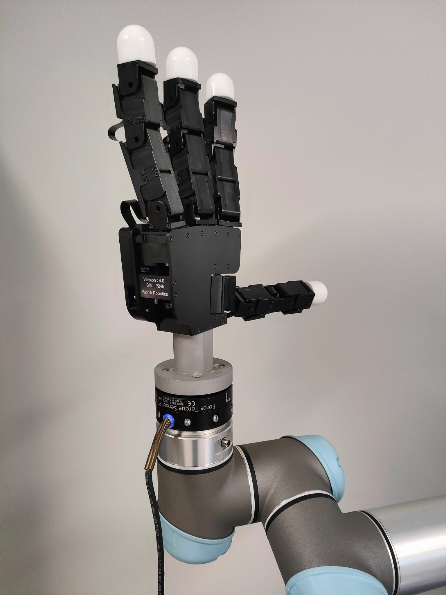
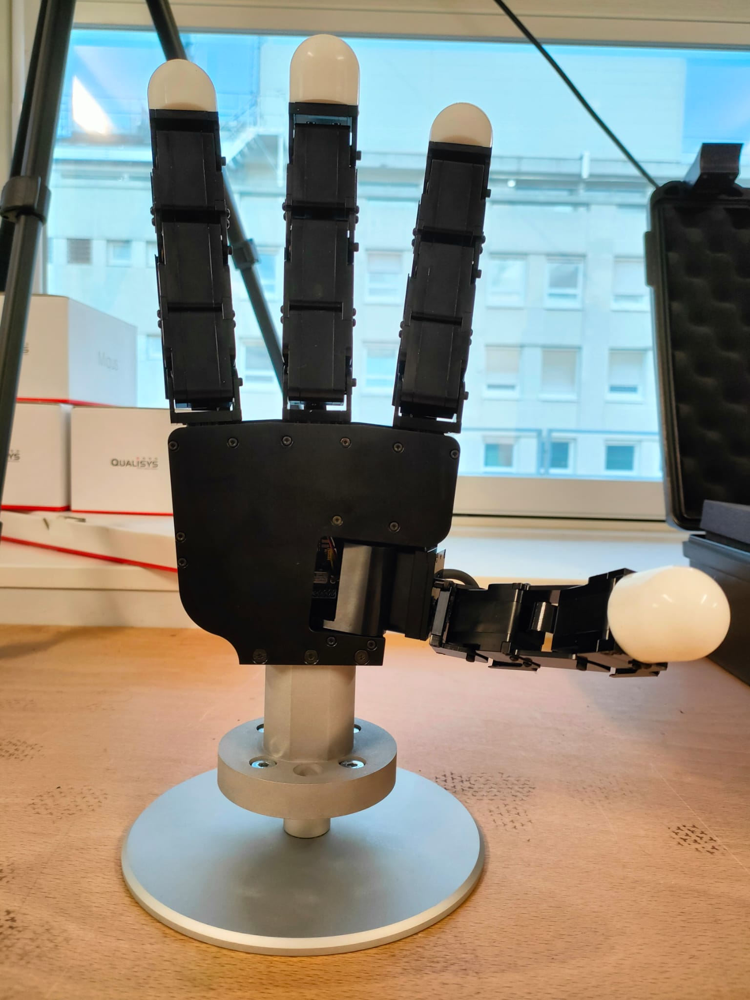
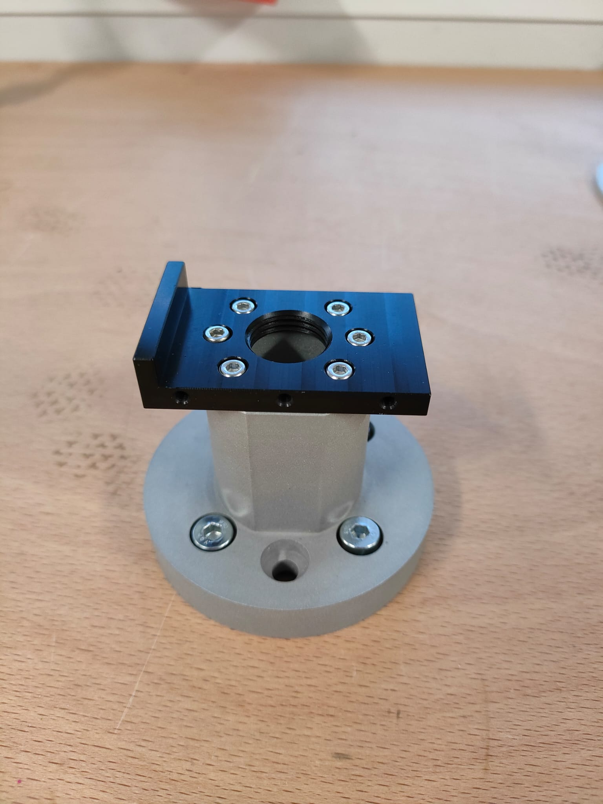
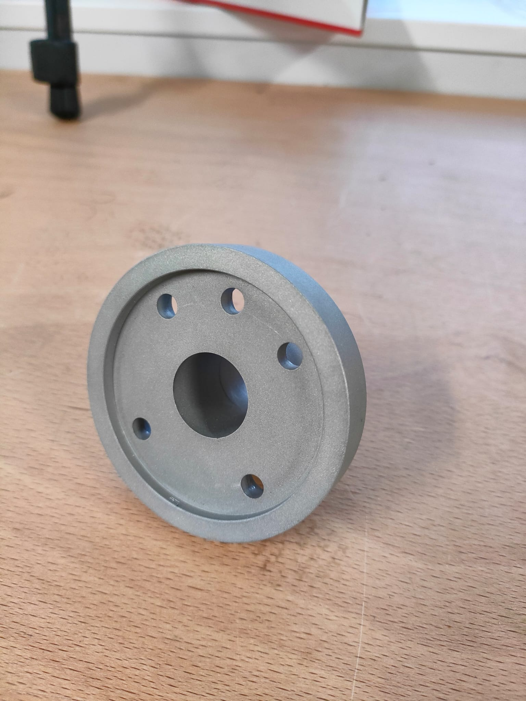

# allegro_hand_hardware
Hardware interface to attach an Allegro Hand v4 to a UR5 arm.

 | 
:-------------------------:|:-------------------------:
 | 

## Available files
* [Freecad](https://www.freecad.org) source file : [CAD/Allegro_support.FCStd](CAD/Allegro_support.FCStd)
* Exported **.step** : [CAD/Allegro_support_v1_1.step](CAD/Allegro_support_v1_1.step)
* Exported stl : [CAD/Allegro_support_v1_1.stl](CAD/Allegro_support_v1_1.stl)

* Technical drawing : [CAD/Allegro_support_v1_1.pdf](CAD/Allegro_support_v1_1.pdf)

## About the part
* Machined in **aluminium** with a **CNC**.
* Weight: **200g**
* **Sand blasted** for a mat surface finish (to prevent unwanted reflection with our Motion Capture system)
* Price (2024): <200€ from local machinist (Including sand blasting, VAT, shipping, ...). Machinist found from [usineur.fr](https://usineur.fr).

## Assembly
Requires:
* 4x M6 * 10mm screws
* 6x M3 * 8mm screws